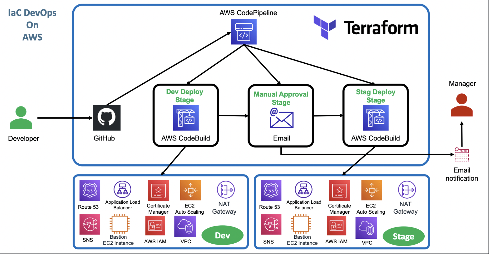

### AWS Infrastructure as Code Codepipeline with Terraform
AWS Infrastructure as Code(IaC) using Codepipeline with Terraform to provision resources for an enterprize application.

#### Environment Commands 
- Terraform Initialize `terraform init`
- Observation: Initialized Local Backend,Downloaded the provider plugins (initialized plugins) and Review the folder structure `.terraform folder`
- Terraform Validate `terraform validate`
- `Observation:` If any changes to files, those will come as printed in stdout (those file names will be printed in CLI)
- Terraform Plan `terraform plan` -> Observation: `No changes - Just prints the execution plan`
- Terraform Apply `terraform apply` then approve OR `terraform apply -auto-approve`
- `NOTE:`To use the secret file for the DB - run `terraform plan -var-file=secrets.tfvars` OR `terraform apply -var-file=secrets.tfvars`
- Terraform Destroy `terraform plan destroy` then approve OR `terraform destroy -auto-approve`
- Clean-Up Files: `rm -rf .terraform*` and `rm -rf terraform.tfstate*`
#### Environmental Execution Individual Files
Deployment to different environments requires merging all the `.auto.tfvars` files to leverage the same terraform configuration across environments
- Pass the `.tfvars` file `-var-file` argument to `terraform apply` for each environment -> `terraform apply -input=false -var-file=dev.tfvars -auto-approve `
#### Store Secrets
- Navigate to `AWS Systems Manager` -> Application tools then select `Parameter Store` to create secret variables
- Create a `GetParameter` access in `AWS IAM` for CodeBuild service role build project
